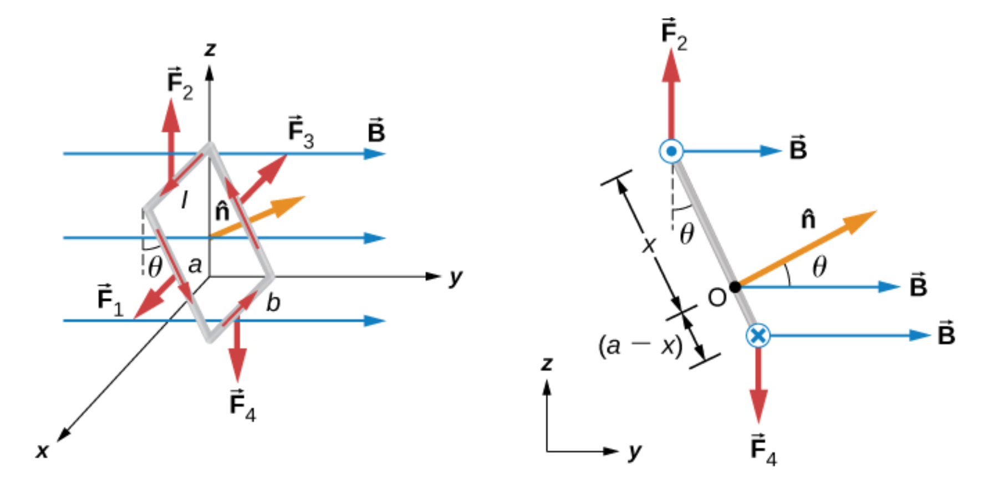

Tags: #Topic 

# Magnetic Force on a Current-Carrying Wire

Since a current-carrying wire is just the movement of electrons, which are charged particles, the wire will experience a magnetic force if placed in a magnetic field.

Given a wire of length $\vec L$ carrying a current $I$ and placed in a uniform magnetic field of $\vec B$,  and where $\theta$ is the angle between $\vec L$ and $\vec B$, then

$$\Large F_B = I \vec L \times \vec B$$
$$\Large F_B = I L B \sin \theta$$

>**NOTE:**
>$\vec L$ has a magnitude of the length of the wire and points in the direction of the flow of $I$, the current in the wire.

## Right-Hand Rule

To determine the direction of $\vec B$, $\vec v$, and $F_B$, we use the right hand rule. Using your right hand, your middle finger points in  $\vec B$, your index finger points in $I$, and your thumb points in $F$. 

You can use the mnemonic "BIFF" to memorize the order of the terms, which is $BIF$, starting on the middle finger and going to the right.

>**NOTE:**
> This right-hand rule build off the fact that the charged particle right-hand rule gives the direction for a **positive** particle. Since currents coventionally point in the direction of positive charge, this rule holds.

## Torque on Current-Carrying Loops

We can use the right-hand rule to figure out the direction of $F_B$ on a current-carrying loop in a B-field.

In general, a current carrying loop wants to orient itself perpendicularly with the B-field. However if you want to know which side of the loop is on the top/bottom, you would have to use $F=I \vec L \times \vec B$.

The actual torque on a current-carrying loop can be found using

$$\tau = N i \vec A \times \vec B$$

> **LEGEND:**
> $N$ - Number of turns of the loop.
> $i$ - The current moving through the loop
> $\vec A$ - A vector with the magnitude of the area of the loop and pointing in the direction perpendicular to the plane of the loop.
> $\vec B$ - The uniform magentic field that the loops is inside of. 

> **NOTE:**
> The direction of $\vec A$ is specifically found using a right-hand rule. Wrapping your fingers around the direction of the current in the loop, point your thumb up. Your thumb will be pointing the direction of $\vec A$. 